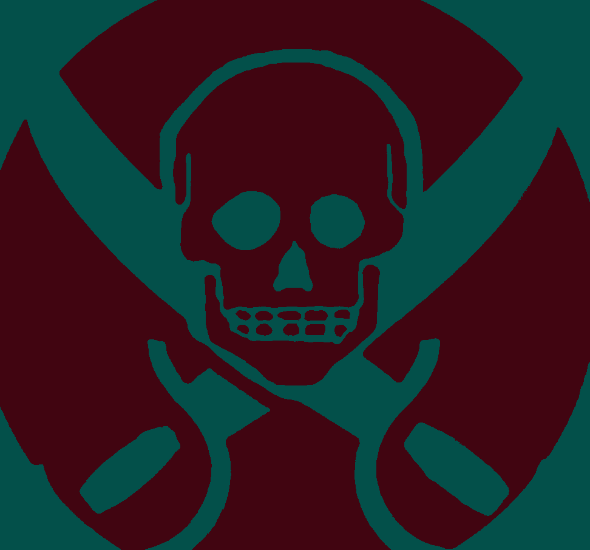
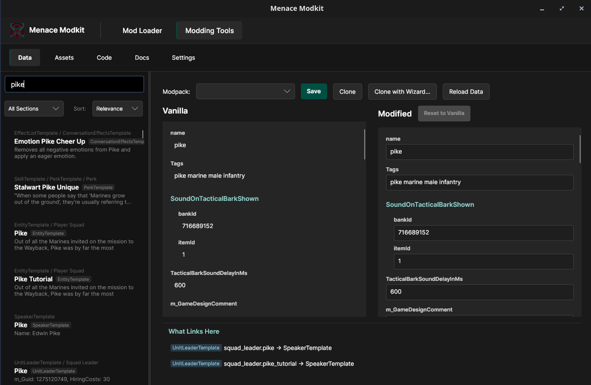

# Menace Modkit

<p align="center">
  
</p>

<p align="center">
  <strong>A modloader and modding toolkit for <a href="https://store.steampowered.com/app/2432860/MENACE/">MENACE</a></strong>
</p>

<p align="center">
  Create mods without touching game files. Tweak stats, replace textures, add custom code — all through a visual editor.
</p>

<p align="center">
  
</p>

## What's Included

**Modkit App** — A desktop application for creating and managing mods:
- **Stats Editor** — Browse and edit game data (weapons, armor, units) with side-by-side vanilla comparison
- **Asset Browser** — View extracted game assets and set up texture/model/audio replacements
- **Code Editor** — Write C# mod code with compilation, security scanning, and error checking
- **Modpack Manager** — Create, organize, and deploy modpacks with one click

**ModpackLoader** — A runtime mod that loads your modpacks into the game:
- Applies stat patches and asset replacements at startup
- Provides an [SDK](docs/coding-sdk/index.md) for C# mods to interact with the game
- Includes an in-game [Dev Console](docs/coding-sdk/api/dev-console.md) (press `~`) for debugging and live commands

## Documentation

📖 **[Full Documentation](docs/index.md)** — Start here for guides and API reference

| I want to... | Go to... |
|--------------|----------|
| Make my first mod | [Baby's First Mod](docs/modding-guides/01-first-mod.md) |
| Change weapon/unit stats | [Stat Adjustments](docs/modding-guides/02-stat-changes.md) |
| Create new unit variants | [Template Cloning](docs/modding-guides/03-template-cloning.md) |
| Replace textures | [Textures & Icons](docs/modding-guides/04-textures-icons.md) |
| Write code mods | [SDK Basics](docs/modding-guides/07-sdk-basics.md) |
| Look up SDK APIs | [Coding SDK Reference](docs/coding-sdk/index.md) |
| Debug my mod | [Debugging Guide](docs/coding-sdk/guides/debugging-guide.md) |

## Getting Started

### Requirements

- .NET 10+ SDK
- [MENACE](https://store.steampowered.com/app/2432860/MENACE/) or [MENACE Demo](https://store.steampowered.com/app/2432870/MENACE_Demo/) installed via Steam
- Windows or Linux

### Quick Start

```bash
# Build and run the desktop app
dotnet run --project src/Menace.Modkit.App
```

On first launch the app will:
1. Detect your game installation
2. Install MelonLoader (the mod framework) if needed
3. Deploy the DataExtractor to pull game data
4. Prompt you to launch the game once to extract templates

After that, the Stats Editor, Asset Browser, and Code Editor are ready to use.

### Building Releases

```bash
./build-redistributables.sh
```

Creates self-contained builds in `dist/`:
- `dist/gui-linux-x64/` — Linux GUI
- `dist/gui-win-x64/` — Windows GUI

## Modpack Structure

A modpack is a folder with a `modpack.json` manifest:

```
MyModpack/
  modpack.json          # Name, author, version, load order
  stats/                # JSON patches for game templates
    WeaponTemplate.json
    EntityTemplate.json
  assets/               # Replacement textures, audio, etc.
    textures/
  src/                  # C# source files (compiled on deploy)
    MyMod.cs
```

See the [modding guides](docs/modding-guides/index.md) for detailed tutorials.

## Projects

| Project | Description |
|---------|-------------|
| **Menace.Modkit.App** | Avalonia desktop GUI — stats editor, asset browser, code editor |
| **Menace.Modkit.Core** | Shared library — asset bundles, type trees, patch merging |
| **Menace.ModpackLoader** | MelonLoader mod — loads modpacks, provides SDK and DevConsole |
| **Menace.DataExtractor** | MelonLoader mod — extracts game templates to JSON |

Example modpacks in `third_party/bundled/modpacks/`:
- **DevMode-modpack** — Dev tools (god mode, spawning, teleport)
- **CombinedArms-modpack** — AI coordination features
- **TwitchSquaddies-modpack** — Twitch chat integration

## Dev Console

Press **`~`** in-game to open the developer console:

| Panel | Purpose |
|-------|---------|
| **Battle Log** | Combat events with filtering |
| **Log** | Error and debug messages |
| **Console** | Commands + C# REPL |
| **Inspector** | Property viewer for game objects |
| **Watch** | Live expression monitoring |

Commands: `find <type>`, `inspect <type> <name>`, `templates <type>`, `scene`, `errors`

See [Dev Console docs](docs/coding-sdk/api/dev-console.md) for the full command reference.

## Twitch Integration

The **TwitchSquaddies** system lets Twitch viewers control squaddies:

1. Run `tools/TwitchServer/` — connects to Twitch IRC
2. Deploy the TwitchSquaddies modpack
3. Viewers type `!draft` to enter the pool

See [TwitchSquaddies README](third_party/bundled/modpacks/TwitchSquaddies-modpack/README.md) for setup.

## Architecture

See [ARCHITECTURE.md](ARCHITECTURE.md) for technical details.

Key libraries:
- **Avalonia** — Cross-platform UI
- **AssetsTools.NET** — Unity asset reading/writing
- **Roslyn** — C# compilation
- **MelonLoader** — IL2CPP mod injection
- **Harmony** — Runtime method patching

## Running Tests

```bash
dotnet test tests/Menace.Modkit.Tests
dotnet test tests/Menace.ModpackLoader.Tests
```

## License

[GNU General Public License v3.0](LICENSE)
